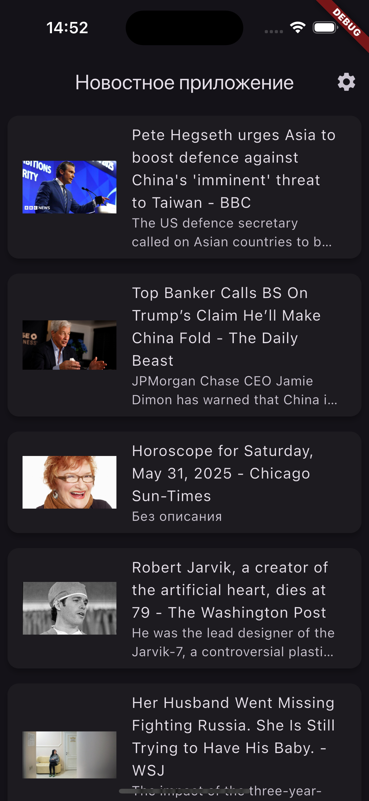
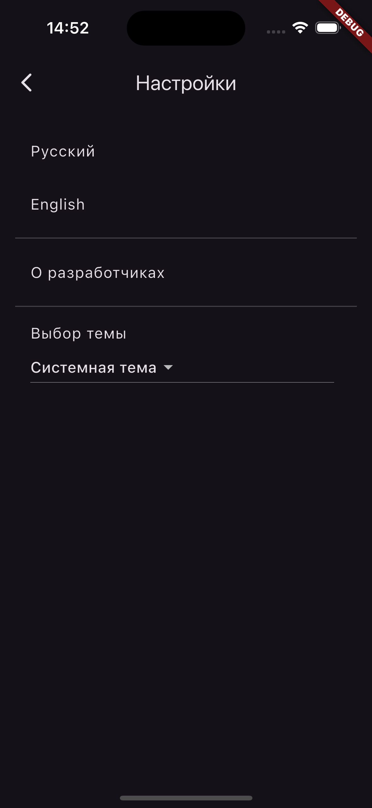
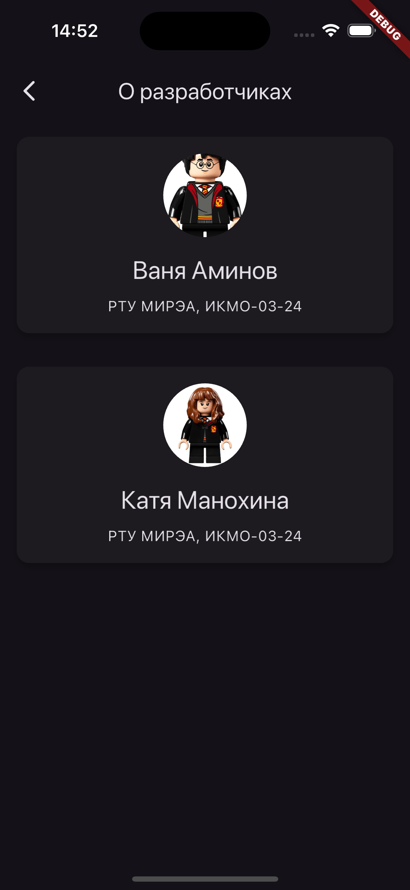

# News App

## Описание
Новостное приложение, разработанное для курса МИРЭА. Приложение позволяет просматривать список новостных статей, загружаемых через NewsAPI, и открывать подробности статьи (заголовок, описание, изображение, дата и ссылка на полный текст). Поддерживает светлую и темную темы, а также интернационализацию (английский и русский языки). Дополнительно реализован экран настроек и экран "О разработчиках".

---

## Чек-лист выполнения домашнего задания

### 1. Экран списка новостей
- **Описание**: Отображает список новостей, загружаемых через NewsAPI. Каждая новость содержит заголовок, описание и изображение.
- **Файл**: [`home_screen.dart`](lib/screens/home_screen.dart)
- **Скриншот**:
  

### 2. Экран статьи
- **Описание**: Показывает детали выбранной статьи, включая заголовок, описание, изображение, дату публикации и кнопку для перехода на полный текст статьи.
- **Файл**: [`article_screen.dart`](lib/screens/article_screen.dart)
- **Скриншот**:
  

### 3. Экран настроек
- **Описание**: Содержит выбор языка (русский или английский) и кнопку для перехода на экран "О разработчиках".
- **Файл**: [`settings_screen.dart`](lib/screens/settings_screen.dart)
- **Скриншот**:
  

### 4. Экран "О разработчиках"
- **Описание**: Отображает визитки разработчиков с анимацией переворота. На обратной стороне визитки ссылки на GitHub и email кликабельны.
- **Файл**: [`about_screen.dart`](lib/screens/about_screen.dart)
- **Скриншот**:
  

### 5. Интернационализация
- **Описание**: Поддерживаются английский и русский языки. Локализация реализована через `intl` и `flutter_localizations`.
- **Файлы**: [`app_localizations.dart`](lib/l10n/app_localizations.dart), [`app_ru.arb`](lib/l10n/app_ru.arb), [`app_en.arb`](lib/l10n/app_en.arb)

### 6. Темы
- **Описание**: Поддерживаются светлая и темная темы, которые автоматически переключаются в зависимости от системных настроек.
- **Файл**: [`main.dart`](lib/main.dart)

### 7. API ключ
- **Описание**: Используется файл `.env` для хранения API ключа.
- **Файлы**: [`main.dart`](lib/main.dart), [`api_service.dart`](lib/services/api_service.dart), [`.env`](assets/.env)

### 8. Кэширование данных
- **Описание**: Пока не реализовано. Можно добавить в будущем с использованием `shared_preferences` или `hive`.

### 9. Обработка ошибок
- **Описание**: В случае ошибки загрузки данных отображается сообщение об ошибке. Добавлена возможность повторной попытки загрузки.
- **Файлы**: [`home_screen.dart`](lib/screens/home_screen.dart), [`article_screen.dart`](lib/screens/article_screen.dart)

### 10. Тестирование
- **Описание**: Пока не реализовано. Можно добавить модульные тесты для проверки работы API, локализации и экранов.

---

## Технические детали

- **Используемые пакеты**: `http`, `json_serializable`, `flutter_dotenv`, `url_launcher`, `intl`.
- **Код отформатирован**: с помощью `dart format`.
- **Проверен на ошибки**: с помощью `flutter_lints`.
- **Модель данных**: сериализуется с помощью `json_serializable`.
- **API**: NewsAPI (https://newsapi.org/).

---

## Установка

1. Установите Flutter SDK.
2. Склонируйте репозиторий.
3. Создайте файл `.env` с ключом `NEWS_API_KEY=your_api_key`.
4. Выполните `flutter pub get`.
5. Сгенерируйте код для модели: `flutter pub run build_runner build`.
6. Соберите APK: `flutter build apk --release`.

---

## Разработчики

- **Имя**: Ваня Аминов и Катя Манохина
- **Группа**: ИКМО-03-24